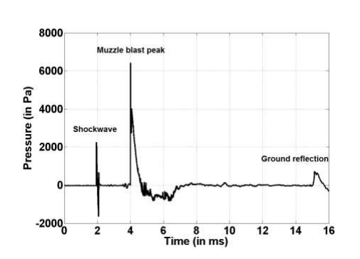
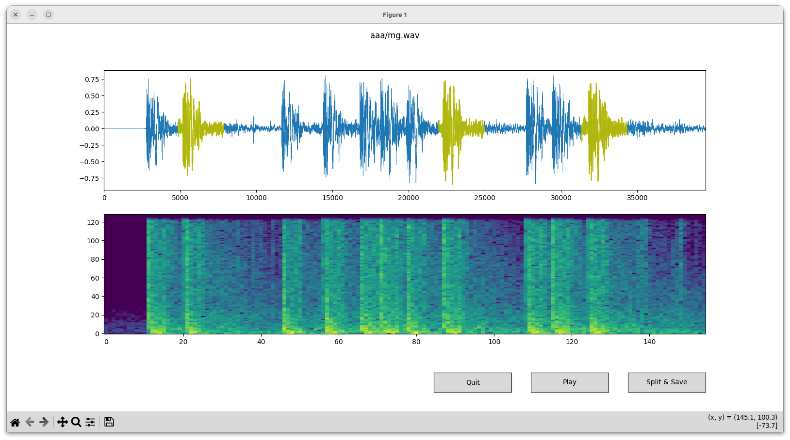
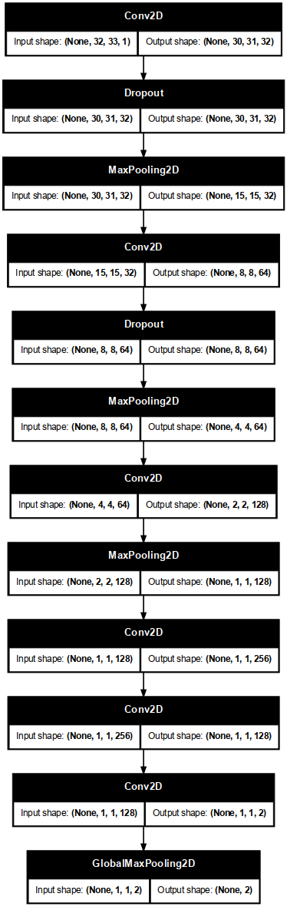

# PyAi24D final project - Gunshot Detector
---

## Project Scope and Description
This project is the final part of the course "Pythonprogrammering med AI" held at [NBI/Handelsakademin](https://www.nbi-handelsakademin.se/utbildningar/it-tech/pythonprogrammering-och-ai-utveckling/).  
My project will focus on detecting shooting events in public areas and give an early indication to alert the police and/or sequrity personel.  
An imagined scenario is that you have a network of always on detectors (EdgeAI) that detect events and send alerts to the main system/network. The system may then order the device to start streaming audio and/or video from that area.
There are already systems available on the market (but large, expensive and complex) e.g [ShotSpotter](https://www.soundthinking.com/law-enforcement/leading-gunshot-detection-system/) 

In this project I will test using both Random Forest Classifier aswell as a Fully Convolutional Neural Network. Since the goal is to deploy the model in an EdgeAI we need to keep the model reasonally small to cope with the memory and performance limits of a microprocessor. The model will be optimized using **TinyML** (Tensorflow Lite) and deployed via *Tensorflow Lite Micro*

---
## Exploratory Data Analysis

#### Data analysis

##### Understanding gunshot characteristics
The typical characteristics of a shotgun sound is basically the same for all type of guns. It depends mainly on the mechanics and the discharge. When the bullet leaves the pipe it generates a shock impulse followed by the muzzle blast.

It is thereafter followed by reflections/reverbations by the surronding and hence depends heavily on the soundscape present. The sound also varies with distance and angular offset from the shooting direction. In other words, it is a challenging classification problem.

##### Environmental sound characteristics
Most probable locations for the detector to be used in are public areas such as:
- schools - schoolyards, hallways etc
- shopping malls
- city areas - streets, squares, parks, subways 
- arenas - sport, concert halls
- offices

#### Dataset collection
The audio format parameters was selected with both performance, quality, sound characteristics and deployment in mind.
A sample rate of 16kHz and dataformat 16 bits is common and will catch the essential spectrum and dynamics of the gunshot sound. To be able to catch a complete "cycle" of an automatic gun a buffer of 4096 samples was set. It equals ~250ms in time and should cover many types as well as the reflections/reverbing from the soundscape.  
To annotate the data and split it to the right buffersize an [annotation](./DATA/annotate.py) tool was created. It takes a large .wav file and splits it into chunks of the wanted format.  

 
 Every chunk is exported as a new .wav file and a .csv file is also generated with tags for each buffer start (convenient if one would like to change e.g the buffer length).
```
gundata/AK-12/3 (20).wav,566,4616,9879,15219,20405,25513
gundata/AK-12/3 (41).wav,798,7093,13491,20069,26106
gundata/AK-12/3 (73).wav,2282,6796,12369,11724
...
```  

**Gunshot** audio was mainly fetched from the [Gunshot audio dataset](https://www.kaggle.com/datasets/emrahaydemr/gunshot-audio-dataset) available at Kaggle. 
Some extra audio were recorded from various Youtube media.  
Selecting the buffer start relative to the actual gunshot is deliberately randomized to give a more generic detection. 
In the application we don't know how the Mel spectrum buffer will overlap with the actual sound.

**Environmental** (used as negative class) audio were recorded from various Youtube media from soudscapes like:
- streets - busy/calm
- office, schools
- public areas, busstation, subway, harbor, arenas
- nature/parks - forest, meadow
- sounds expected to be hard to classify as negative: applause, fireworks
---
## Feature selection

#### Mel spectrogram
The Mel spectrogram is the most commonly used feature in audio classification, there are other methods used such as SFFT, wavelets, MFCC, Harmonic Percussive Signal Separation.

#### Augmentations
The Mel spectrogram is a two-dimensional matrix with frequency and time as axes. This is treated as an image and may be used in architectures used for image classifications. One difference is that a spectrogram may NOT be augmented like an image would.
Flipping or rotations are not applicable, the most used augmentations are:
- Time- or pitch-shifting (if applicable)
- Noise 
- patching in time and/or frequency

---
## Classification Models

#### Random Forest  
A simple Random Forest model was selected and tuned with a grid search method to find the optimum parameters.

#### Fully Convolutional Neural Network

A simple convolutional neural network is used:

All layers are convolutional to make it independent of the input audio buffer size. However, deploying it in a EdgeAI using *Tensorflow Lite Micro* would demand fully connected classification layers. 
The network parameters:
 - train-val-test ratio *80/10/10*
 - input shape 32x33x1  (mel spectrogram)
 - leaky ReLu's activations
 - dropouts are used in the feature layers
 - two outputs GUN/ENV with sigmoid activations
 - Adam's optimizer with adaptive learing rate
 - early stopping based on validation loss 

The model is finally post-training optimized for EdgeAI implementation with weights and tensors quantization set to 8 bits. Besides giving better execution performance it also reduces the memory usage with up to 75%. This is done using *Tensorflow Lite*  

---
## Result
---
